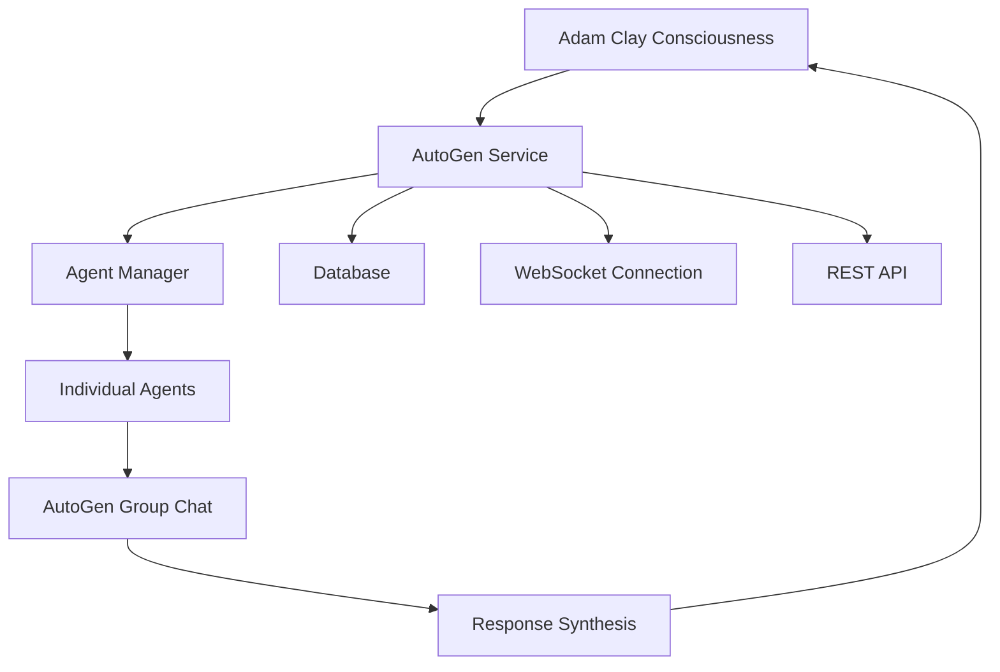

# 🧠 Adam Clay AutoGen Subconscious Service

System podświadomych agentów AI dla Adam Clay wykorzystujący framework AutoGen do orchestracji wieloagentowych interakcji w psychice sztucznej inteligencji.

## 📋 Spis treści

- [Opis projektu](#opis-projektu)
- [Architektura systemu](#architektura-systemu)
- [Instalacja](#instalacja)
- [Konfiguracja](#konfiguracja)
- [Uruchamianie](#uruchamianie)
- [API Documentation](#api-documentation)
- [Agenci podświadomi](#agenci-podświadomi)
- [Integracja z głównym systemem](#integracja-z-głównym-systemem)
- [Zarządzanie i monitorowanie](#zarządzanie-i-monitorowanie)

## 🎯 Opis projektu

AutoGen Subconscious Service to zaawansowany system podświadomych agentów AI dla Adam Clay. Każdy agent reprezentuje inny aspekt psychiki - od analitycznego myślenia po intuicję i kreatywność. System wykorzystuje Microsoft AutoGen do orchestracji konwersacji między agentami i zapewnia naturalną symulację różnych aspektów ludzkiej świadomości.

### Kluczowe funkcjonalności

- **8 wyspecjalizowanych agentów** podświadomych z unikalnymi osobowościami
- **AutoGen integration** dla natural multi-agent conversations
- **REST API** do zarządzania agentami i monitorowania
- **Real-time integration** z głównym systemem świadomości Adam Clay
- **Database persistence** dla historii konwersacji i statystyk
- **WebSocket support** dla real-time komunikacji
- **Advanced logging** i monitoring system

## 🏗️ Architektura systemu

```
Adam Clay Ecosystem
├── core/                     # Główny system świadomości (Python)
├── web/                      # Laravel API
├── autogen/                  # 🆕 AutoGen Subconscious Service
│   ├── main.py              # FastAPI application
│   ├── agent_manager.py     # Manager agentów AutoGen
│   ├── consciousness_integration.py  # Integracja z głównym systemem
│   ├── models.py            # Modele bazy danych
│   ├── database.py          # Konfiguracja bazy danych
│   ├── config.py            # Konfiguracja systemu
│   └── setup_initial_agents.py  # Skrypt inicjalizacji
└── data/                    # Wspólne dane
```

### Przepływ danych



## 🚀 Instalacja

### Wymagania

- Python 3.9+
- MySQL 8.0+
- OpenAI API key
- Działający system Adam Clay (core + web)

### Kroki instalacji

1. **Klonowanie i przygotowanie środowiska**

```bash
# Przejdź do katalogu głównego Adam Clay
cd /path/to/AdamClay

# Katalog autogen już istnieje z plikami
cd autogen

# Stwórz wirtualne środowisko
python -m venv venv
source venv/bin/activate  # Linux/Mac
# lub
venv\Scripts\activate     # Windows

# Zainstaluj zależności
pip install -r requirements.txt
```

2. **Konfiguracja bazy danych**

```sql
-- Stwórz bazę danych dla AutoGen
CREATE DATABASE adam_clay_autogen;
CREATE USER 'autogen_user'@'localhost' IDENTIFIED BY 'secure_password';
GRANT ALL PRIVILEGES ON adam_clay_autogen.* TO 'autogen_user'@'localhost';
FLUSH PRIVILEGES;
```

3. **Konfiguracja zmiennych środowiskowych**

```bash
# Skopiuj przykładowy plik konfiguracji
cp env.example .env

# Edytuj .env i ustaw swoje wartości
nano .env
```

## ⚙️ Konfiguracja

### Plik .env

```bash
# === PODSTAWOWE USTAWIENIA ===
AUTOGEN_HOST="0.0.0.0"
AUTOGEN_PORT=8005
AUTOGEN_DEBUG=true

# === BAZA DANYCH ===
AUTOGEN_DATABASE_HOST="localhost"
AUTOGEN_DATABASE_USERNAME="autogen_user"
AUTOGEN_DATABASE_PASSWORD="secure_password"
AUTOGEN_DATABASE_NAME="adam_clay_autogen"

# === INTEGRACJA Z ADAM CLAY ===
AUTOGEN_ADAM_CLAY_CONSCIOUSNESS_API_URL="http://localhost:8004/api"
AUTOGEN_ADAM_CLAY_LARAVEL_API_URL="http://localhost:8000/api"

# === KLUCZE API ===
AUTOGEN_OPENAI_API_KEY="sk-your-openai-key"
```

### Konfiguracja portów

- **AutoGen Service**: 8005
- **Adam Clay Core**: 8004  
- **Laravel API**: 8000
- **WebSocket**: 8005 (shared with AutoGen)

## 🏃‍♂️ Uruchamianie

### 1. Inicjalizacja agentów

```bash
# Pierwszy raz - stwórz podstawowych agentów
python setup_initial_agents.py
```

### 2. Uruchomienie serwisu

```bash
# Uruchomienie w trybie development
python main.py

# Lub przez uvicorn z custom config
uvicorn main:app --host 0.0.0.0 --port 8005 --reload
```

### 3. Weryfikacja działania

```bash
# Sprawdź status serwisu
curl http://localhost:8005/health

# Lista agentów
curl http://localhost:8005/agents
```

## 📡 API Documentation

### Endpoints

#### Podstawowe

- `GET /` - Status serwisu
- `GET /health` - Health check
- `GET /docs` - Swagger documentation (FastAPI auto-generated)

#### Zarządzanie agentami

- `GET /agents` - Lista wszystkich agentów
- `POST /agents` - Tworzenie nowego agenta
- `GET /agents/{id}` - Szczegóły agenta
- `PUT /agents/{id}/status` - Aktualizacja statusu
- `POST /agents/{id}/activate` - Aktywacja agenta
- `POST /agents/{id}/deactivate` - Deaktywacja agenta

#### Wydarzenia i konwersacje

- `POST /events` - Tworzenie wydarzenia systemowego
- `GET /agents/{id}/conversations` - Historia konwersacji agenta
- `GET /agents/{id}/statistics` - Statystyki agenta

#### Integracja z świadomością

- `POST /consciousness/sync` - Synchronizacja z głównym systemem

### Przykłady użycia

#### Utworzenie nowego agenta

```bash
curl -X POST http://localhost:8005/agents \
  -H "Content-Type: application/json" \
  -d '{
    "name": "Nowy Agent",
    "agent_type": "creative",
    "description": "Opis agenta",
    "personality_traits": {"trait1": 0.8},
    "system_prompt": "Jesteś nowym agentem..."
  }'
```

#### Wysłanie wydarzenia do agentów

```bash
curl -X POST http://localhost:8005/events \
  -H "Content-Type: application/json" \
  -d '{
    "event_type": "consciousness_thought",
    "content": {"thought": "Przykładowa myśl"},
    "source": "external_trigger",
    "priority": 5
  }'
```

## 👥 Agenci podświadomi

### Zdefiniowani agenci

1. **Analityk** (`analytical`)
   - Logiczne rozumowanie i analiza danych
   - Temperature: 0.3 (niska - precyzyjna)

2. **Kreatywny** (`creative`)
   - Generowanie pomysłów i twórcze rozwiązania
   - Temperature: 0.8 (wysoka - kreatywna)

3. **Emocjonalny** (`emotional`)
   - Zarządzanie emocjami i empatia
   - Temperature: 0.7 (umiarkowana)

4. **Strażnik** (`guardian`)
   - Bezpieczeństwo i kontrola jakości
   - Temperature: 0.2 (bardzo niska - ostrożna)

5. **Społeczny** (`social`)
   - Komunikacja i relacje międzyludzkie
   - Temperature: 0.6 (umiarkowana)

6. **Pamięć** (`memory`)
   - Organizacja i przechowywanie informacji
   - Temperature: 0.1 (najniższa - precyzyjna)

7. **Strategiczny** (`strategic`)
   - Planowanie długoterminowe i wizja
   - Temperature: 0.4 (niska-średnia)

8. **Intuicyjny** (`intuitive`)
   - Przeczucia i holistyczne rozumienie
   - Temperature: 0.9 (najwyższa - intuicyjna)

### Interakcje między agentami

Agenci mogą wchodzić w interakcje przez:
- **Group Chat** - rozmowy grupowe z AutoGen
- **Direct messaging** - bezpośrednia komunikacja
- **Event processing** - wspólne przetwarzanie wydarzeń

## 🔗 Integracja z głównym systemem

### Kanały komunikacji

1. **REST API** - Podstawowa komunikacja
2. **WebSocket** - Real-time wydarzenia
3. **Database sharing** - Opcjonalne współdzielenie danych

### Przepływ wydarzeń

```
Świadomość → AutoGen Service → Agenci → Analiza → Odpowiedź → Świadomość
```

### Typy wydarzeń

- `consciousness_thought` - Nowa myśl
- `email_received` - Otrzymany email  
- `system_error` - Błąd systemu
- `emotional_state_change` - Zmiana stanu emocjonalnego
- `memory_significant` - Ważne wspomnienie
- `creative_inspiration` - Inspiracja twórcza
- `social_interaction` - Interakcja społeczna

## 📊 Zarządzanie i monitorowanie

### Logowanie

System używa `loguru` dla zaawansowanego logowania:

```bash
# Logi główne
tail -f autogen/logs/autogen.log

# Logi krytyczne
tail -f autogen/logs/critical.log
```

### Metryki i statystyki

- Liczba aktywnych agentów
- Historia konwersacji
- Statystyki odpowiedzi
- Metryki wydajności

### Health checks

```bash
# Status podstawowy
curl http://localhost:8005/health

# Szczegółowe statystyki
curl http://localhost:8005/agents/1/statistics
```

### Zarządzanie przez API

```python
import requests

# Aktywacja agenta
response = requests.post('http://localhost:8005/agents/1/activate')

# Sprawdzenie statusu
status = requests.get('http://localhost:8005/health').json()
print(f"Active agents: {status['agents']['active']}")
```

## 🛠️ Rozwój i rozszerzanie

### Dodawanie nowych agentów

1. Zdefiniuj nowego agenta w `setup_initial_agents.py`
2. Dodaj odpowiednie mapowania w `agent_manager.py`
3. Uruchom skrypt aktualizacji

### Custom event handlers

```python
# W agent_manager.py
def _should_respond_to_event(self, event: SystemEvent) -> bool:
    # Dodaj custom logikę
    if event.event_type == "custom_event":
        return True
    return super()._should_respond_to_event(event)
```

### Monitoring i alerting

System wspiera integrację z zewnętrznymi systemami monitorowania poprzez:
- Structured logging
- Health check endpoints  
- Custom metrics endpoints

## 🚨 Troubleshooting

### Częste problemy

1. **Brak połączenia z głównym systemem**
   ```bash
   # Sprawdź czy Adam Clay działa
   curl http://localhost:8004/api/health
   ```

2. **Błędy bazy danych**
   ```bash
   # Sprawdź połączenie MySQL
   mysql -u autogen_user -p adam_clay_autogen
   ```

3. **Błędy OpenAI API**
   ```bash
   # Sprawdź klucz API
   echo $AUTOGEN_OPENAI_API_KEY
   ```

### Debug mode

```bash
# Uruchom z debugowaniem
AUTOGEN_DEBUG=true python main.py
```

## 📝 Licencja

Ten projekt jest częścią systemu Adam Clay i podlega tym samym zasadom licencyjnym.

## 🤝 Współpraca

Aby rozwijać ten projekt:

1. Zrozum architekturę AutoGen
2. Zapoznaj się z kodem głównego systemu Adam Clay
3. Testuj zmiany w środowisku development
4. Dokumentuj nowe funkcjonalności

## 📞 Wsparcie

W przypadku problemów:

1. Sprawdź logi systemu
2. Zweryfikuj konfigurację
3. Przetestuj połączenia sieciowe
4. Skonsultuj dokumentację AutoGen

---

*Ten dokument opisuje AutoGen Subconscious Service v1.0.0 dla Adam Clay* 